<!-- ============ Bloom Header (day / night follows your theme) ============ -->

  <picture>
    <source media="(prefers-color-scheme: dark)" srcset="bloom-header-night.svg" />
    
  </picture>

<!-- ============ Sky ============ -->

  <picture>
    <source media="(prefers-color-scheme: dark)" srcset="sky-night.svg" />
    
  </picture>

<!-- ============ Tech Garden ============ -->

    
 
     
 
    
 
   

 

<!-- ============ Stats ============ -->

 

<!-- ============ Snake ============ -->

  

<!-- ============ Footer (a cat lives here) ============ -->

  <picture>
    <source media="(prefers-color-scheme: dark)" srcset="garden-footer-night.svg" />
    
  </picture>

